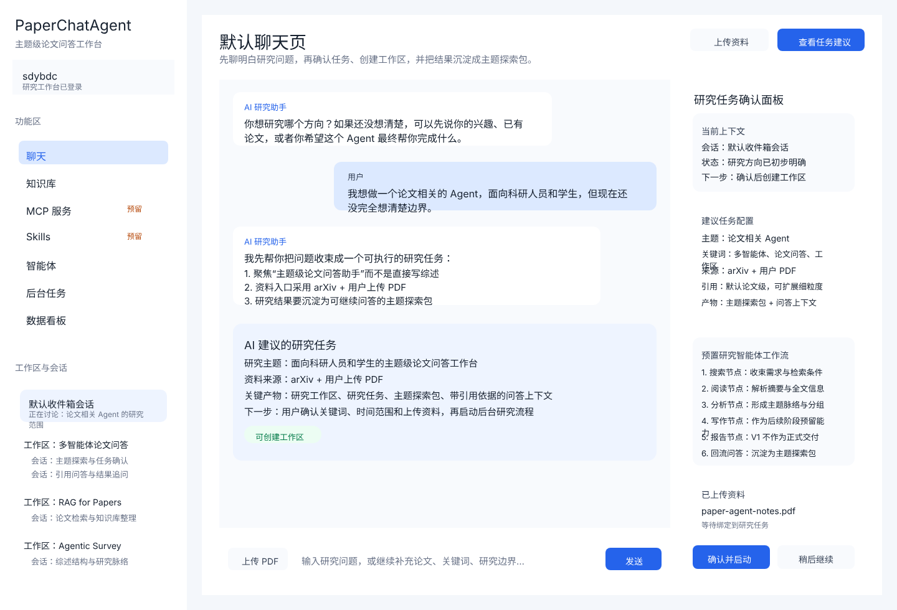
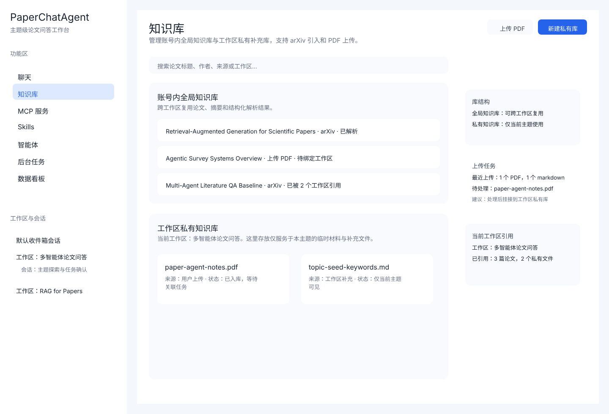
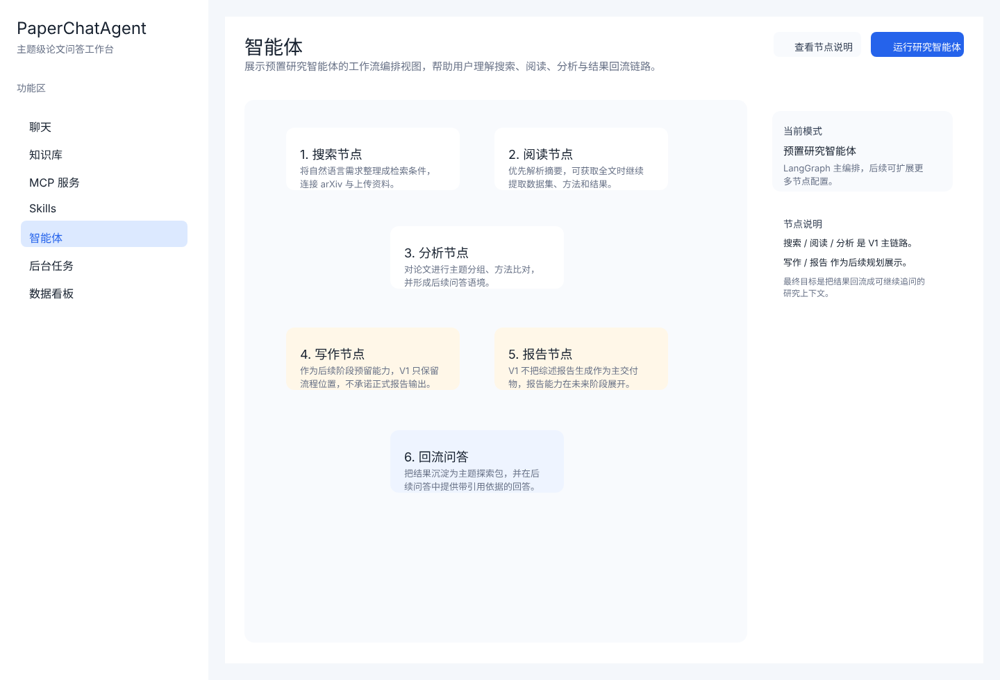
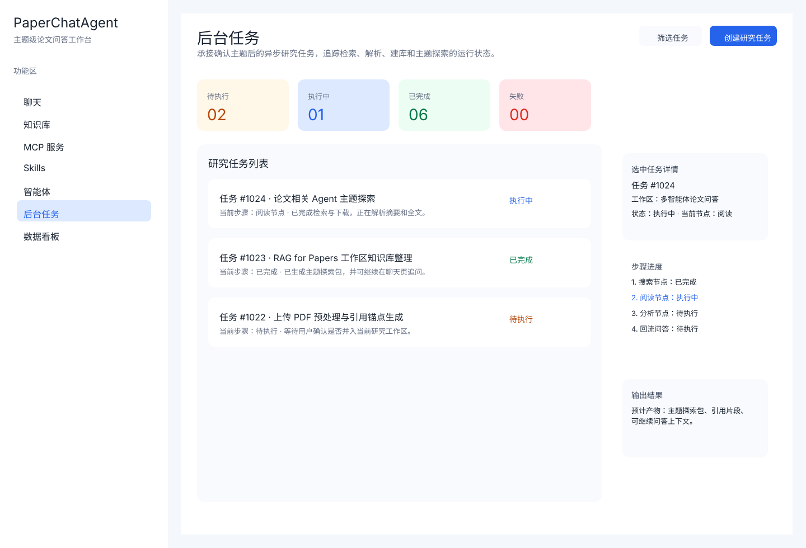

# PaperChatAgent

PaperChatAgent 是一个面向科研人员和学生的论文调研工作台。  
它以聊天为入口，以研究工作区为沉淀对象，以研究任务为执行单元，目标是把“研究方向澄清、论文检索、文献阅读、分析归纳、报告产出、结果回流问答”组织成一套可持续使用的工作流。

当前仓库处于 **开发前期 + 前端第一阶段**：

- 产品需求、技术文档、数据库设计已成型
- 设计稿已完成白色主主题与两套备选主题
- 前端已搭好白色主主题的静态工作台页面
- 后端、Worker、真实工作流与真实接口尚未开始实现

## 当前预览

### 白色主主题

登录页  


注册页  


默认聊天页  


知识库页  


智能体页  


后台任务页  


## 项目目标

PaperChatAgent 当前聚焦以下方向：

- 默认聊天页作为研究入口
- 通过 `默认收件箱会话` 帮用户澄清研究主题
- 在方向明确后创建 `研究工作区`
- 通过后台 `研究任务` 执行完整研究工作流
- 将结果沉淀为 `主题探索包`
- 在后续问答中提供带 `引用依据` 的回答

当前技术路线明确参考两个现有项目：

- `AgentChat`：聊天层、RAG、模型配置、认证与整体后端分层
- `Paper-Agent`：完整论文研究工作流、多智能体节点设计、AutoGen + LangGraph 协作方式

## 核心特性

- 聊天式研究入口：从默认聊天页开始澄清研究方向
- 工作区沉淀：围绕主题长期组织会话、任务、知识和结果
- 双层知识库：账号级全局知识库 + 工作区私有知识库
- 后台任务驱动：研究流程异步执行，前端只负责展示与跟踪
- 完整研究工作流：搜索、阅读、分析、写作、报告、回流问答
- 引用式问答：回答可关联论文与片段级引用依据

## 当前进度

### 已完成

- 中文需求文档与英文需求文档
- 架构文档、技术方案、数据模型、数据库设计、开发启动文档
- MySQL 初始化脚本
- Pencil 设计稿
- 登录页 / 注册页 / 默认聊天页 / 知识库页 / 智能体页 / 后台任务页设计稿
- 前端白色主主题静态实现
- Mock 登录、路由守卫、Pinia 基础状态管理

### 未完成

- FastAPI 后端骨架
- MySQL / Redis / MinIO / ChromaDB 服务接入
- LangChain 聊天层实现
- AutoGen + LangGraph 完整工作流
- 真实接口联调
- SSE 聊天与任务进度流
- 文件上传与知识入库

## V1 核心能力范围

当前 V1 目标页面和能力包括：

- 登录页
- 注册页
- 默认聊天页
- 知识库页
- 智能体页
- 后台任务页

产品主链路：

`登录 -> 默认聊天 -> 澄清需求/上传资料 -> AI 建议研究任务 -> 用户确认 -> 创建工作区 -> 后台执行 -> 结果回流问答`

## 当前前端阶段说明

前端当前采用“**白色主主题 + 静态页为主**”的推进方式：

- 登录页和注册页可直接打开使用
- 登录采用本地 mock：
  - 用户名 / 邮箱：`sdybdc`
  - 密码：`226113`
- 工作台页面以 mock 数据驱动
- 目前不接真实后端 API
- 目前不做移动端适配
- 目前不实现真实 SSE 聊天流和任务进度流

## 技术栈

### 前端

- Vue 3
- Vite
- Vue Router
- Pinia
- Element Plus
- Axios

### 后端规划

- FastAPI
- LangChain
- AutoGen
- LangGraph
- MySQL
- Redis
- MinIO
- ChromaDB

## 文档索引

### 产品与设计

- [需求文档](需求文档.md)
- [Requirements](requirements.md)
- [Pencil MCP 接入说明](docs/pencil-mcp-setup.md)

### 开发准备

- [架构文档](docs/architecture.md)
- [技术方案](docs/technical-design.md)
- [数据模型](docs/data-model.md)
- [数据库设计](docs/database-schema.md)
- [开发启动文档](docs/dev-start.md)
- [MySQL 初始化脚本](sql/mysql_init.sql)
- [开发规范](CONTRIBUTING.md)

## 设计资源

### 当前主设计稿

- [白色主主题设计稿](designs/paperchatagent-workbench.pen)

### 备选设计稿

- [AI 工作台版设计稿](designs/paperchatagent-workbench-ai-workbench.pen)
- [Claude Code 风格设计稿](designs/paperchatagent-workbench-claudecode.pen)

### 白色主主题预览

- [首页](images/light-main/home-wireframe.png)
- [登录页](images/light-main/login-wireframe.png)
- [注册页](images/light-main/register-wireframe.png)
- [知识库页](images/light-main/knowledge-wireframe.png)
- [智能体页](images/light-main/agents-wireframe.png)
- [后台任务页](images/light-main/tasks-wireframe.png)

### 备选主题预览

- `images/ai-workbench/`
- `images/claudecode/`

## 运行方式

### 前端本地运行

```bash
cd apps/frontend
pnpm install
pnpm dev
```

默认访问地址：

- `http://127.0.0.1:5173`

### 当前前端构建检查

```bash
cd apps/frontend
pnpm build
```

当前前端构建已通过。

### 前端目录位置

- `apps/frontend`

## 目录结构

更新约定：

- 只要目录结构、模块职责或服务拆分发生变化，必须同步更新本节 tree
- 本节 tree 应与 `docs/architecture.md` 中的完整目录树保持一致

```text
PaperChatAgent/
├── apps/
│   ├── frontend/                          # Vue 3 工作台前端
│   │   ├── src/
│   │   │   ├── apis/                      # 前端 API client，按资源拆分
│   │   │   ├── components/                # 业务复用组件
│   │   │   ├── layouts/                   # 页面布局，如工作台主布局、登录布局
│   │   │   ├── mocks/                     # mock 数据
│   │   │   ├── pages/                     # 页面级视图
│   │   │   ├── router/                    # 路由配置
│   │   │   ├── stores/                    # Pinia 状态管理
│   │   │   ├── types/                     # 前端 DTO / 页面类型定义
│   │   │   └── utils/                     # 通用工具函数
│   │   ├── package.json                   # 前端依赖定义
│   │   ├── pnpm-lock.yaml                 # 前端锁文件
│   │   └── vite.config.ts                 # Vite 配置
│   ├── backend/                           # FastAPI 主服务（待实现）
│   │   └── paperchat/
│   │       ├── main.py                    # 后端应用入口
│   │       ├── settings.py                # 配置加载入口
│   │       ├── config.example.yaml        # 本地开发配置示例
│   │       ├── api/                       # HTTP / SSE 接口层
│   │       │   ├── responses/             # 统一响应对象
│   │       │   ├── errcode/               # 错误码定义
│   │       │   ├── router.py              # 顶层路由聚合
│   │       │   └── v1/                    # V1 业务接口
│   │       ├── auth/                      # JWT 认证与登录态
│   │       ├── middleware/                # CORS、Trace ID、审计等中间件
│   │       ├── core/                      # 运行时公共能力
│   │       ├── services/                  # 业务服务层
│   │       │   ├── chat/                  # 聊天服务
│   │       │   ├── workspace/             # 工作区服务
│   │       │   ├── knowledge/             # 知识库服务
│   │       │   ├── task/                  # 任务服务
│   │       │   ├── rag/                   # RAG 检索增强
│   │       │   ├── rewrite/               # 查询改写
│   │       │   └── storage/               # MinIO / 对象存储抽象
│   │       ├── database/                  # 持久化层
│   │       │   ├── models/                # ORM / SQLModel 模型
│   │       │   └── dao/                   # 数据访问对象
│   │       ├── workflows/                 # 完整研究工作流
│   │       │   ├── graph/                 # LangGraph 图定义
│   │       │   ├── nodes/                 # search/reading/analyse/writing/report 节点
│   │       │   └── agents/                # AutoGen 智能体定义
│   │       ├── tasks/                     # 后台任务入口与调度封装
│   │       ├── schemas/                   # Pydantic 请求/响应模型
│   │       └── providers/                 # LangChain / 模型供应商抽象
│   └── worker/                            # 独立后台执行器（待实现）
│       └── paperchat_worker/
│           ├── main.py                    # worker 入口
│           ├── consumers/                 # 队列消费者
│           ├── jobs/                      # 具体任务实现
│           └── utils/                     # worker 公共工具
├── designs/                               # Pencil 设计稿
├── docs/                                  # 产品、架构、技术、数据库文档
├── images/                                # 页面导出预览图
├── sql/                                   # 初始化 SQL 与数据库脚本
├── CONTRIBUTING.md                        # 开发规范
├── README.md                              # 项目入口说明
├── requirements.md                        # 英文 PRD
└── 需求文档.md                             # 中文 PRD
```

## 分支与协作

当前仓库采用：

- `main`：稳定主线
- `develop`：开发主线

常规短期分支命名：

- `feature/*`
- `fix/*`
- `docs/*`
- `refactor/*`
- `chore/*`
- `release/*`
- `hotfix/*`

详细规则见：

- [CONTRIBUTING.md](CONTRIBUTING.md)

## 当前最建议的下一步

如果继续往下推进，推荐顺序是：

1. 补 `apps/backend` 骨架
2. 新建 `config.example.yaml`
3. 补 `docker-compose.yml`
4. 先实现认证接口
5. 再联调前端登录页
6. 然后接默认聊天页和工作台基础资源接口
