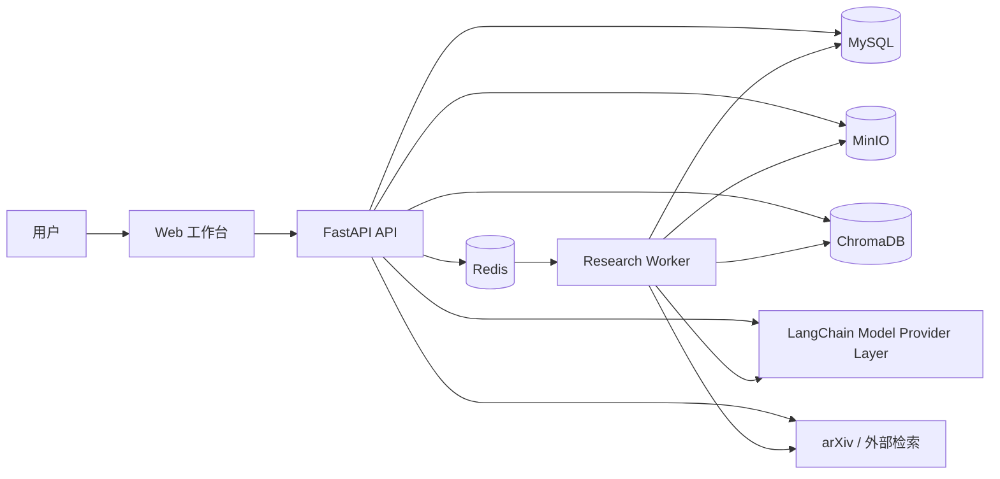
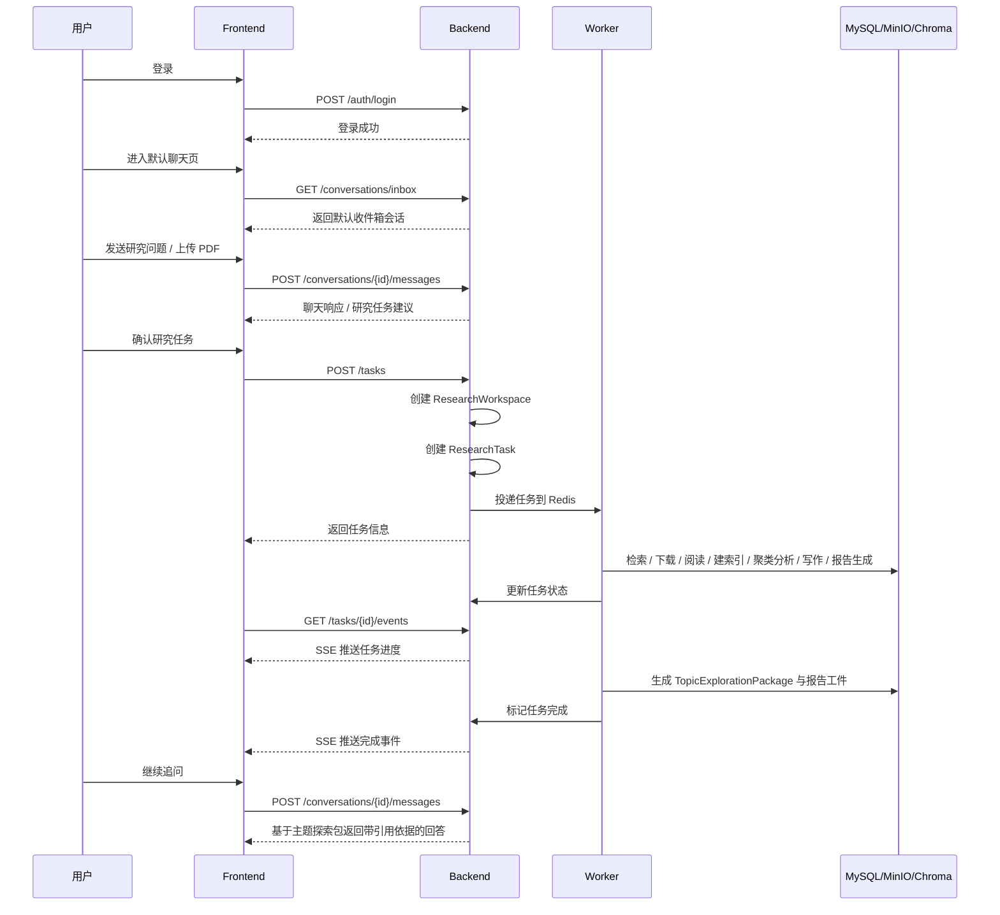
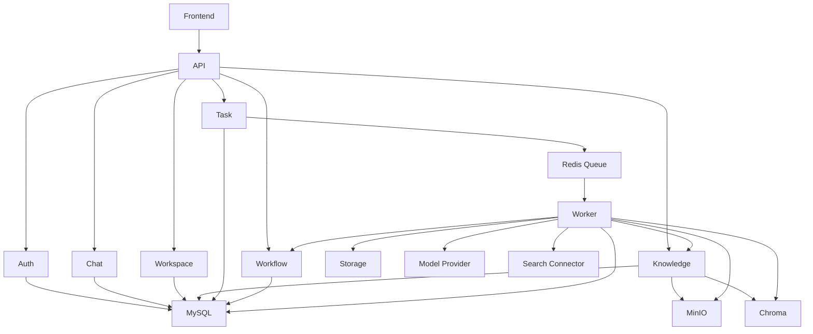

# PaperChatAgent 架构文档

## 1. 文档目标

本文档用于在正式开发前冻结 PaperChatAgent V1 的系统边界、模块职责和主业务链路，确保后续实现者不再需要重新决定系统分层、服务归属和核心执行路径。

PaperChatAgent V1 的产品目标已经在 [需求文档](../需求文档.md) 中定义。本文档聚焦的是“如何组织系统来承载这些需求”。

## 2. 系统目标摘要

PaperChatAgent V1 是一个面向科研人员和学生的论文调研工作台，核心目标如下：

- 以默认聊天页作为研究入口。
- 通过 `默认收件箱会话` 帮助用户澄清研究方向。
- 在研究方向明确后创建 `研究工作区`。
- 通过异步 `研究任务` 完成检索、阅读、分析、写作和报告生成等完整研究工作流。
- 将中间结果沉淀为 `主题探索包`，并将最终结果回流到后续问答与工作区中。
- 问答结果必须附带 `引用依据`。

当前技术路线明确参考两个现有项目：

- 聊天层与知识/RAG 组织参考 `AgentChat`
- 多智能体研究工作流参考 `Paper-Agent`

## 3. Monorepo 分层

V1 采用前后端同仓 Monorepo 结构，推荐目录如下：

```text
PaperChatAgent/
├── apps/
│   ├── frontend/
│   │   # Vue 3 + Vite Web 工作台
│   ├── backend/
│   │   # FastAPI API 服务
│   └── worker/
│       # Redis 队列消费者 / 研究任务执行器
├── docs/
│   # 产品、架构、数据模型、开发文档
├── designs/
│   # Pencil 设计稿
├── images/
│   # 导出的设计预览图
├── 需求文档.md
└── requirements.md
```

这样拆分的理由：

- 前端、后端、任务执行器职责明显不同，但又共享同一套产品模型。
- 现阶段不拆分多仓，减少初始化和版本同步成本。
- 文档、设计和实现保留在同一仓库，便于 AI 和开发者同时理解。

### 3.1 完整建议目录树

后端目录树参考 AgentChat 的分层方式，但根据 PaperChatAgent 当前业务裁剪为更清晰的工作台结构：

更新约定：

- 只要目录结构、模块职责或服务拆分发生变化，必须同步更新本节 tree
- 本节 tree 应与 `README.md` 中的 Architecture Tree 保持一致

```text
PaperChatAgent/
├── apps/
│   ├── frontend/                          # Vue 3 工作台前端
│   │   ├── src/
│   │   │   ├── apis/                      # 前端 API client，按资源拆分
│   │   │   ├── components/                # 业务复用组件
│   │   │   ├── layouts/                   # 页面布局
│   │   │   ├── pages/                     # 页面级视图
│   │   │   ├── router/                    # 路由配置
│   │   │   ├── stores/                    # Pinia 状态管理
│   │   │   ├── types/                     # 前端 DTO / 类型定义
│   │   │   └── utils/                     # 通用工具函数
│   │   ├── package.json                   # 前端依赖定义
│   │   └── vite.config.ts                 # Vite 配置
│   ├── backend/                           # FastAPI 主服务
│   │   └── paperchat/
│   │       ├── main.py                    # 后端应用入口
│   │       ├── settings.py                # 配置加载入口
│   │       ├── config.example.yaml        # 本地开发配置示例
│   │       ├── api/                       # HTTP / SSE 接口层
│   │       │   ├── responses/             # 统一响应对象
│   │       │   ├── errcode/               # 错误码定义
│   │       │   ├── router.py              # 顶层路由聚合
│   │       │   └── v1/                    # V1 业务接口
│   │       ├── auth/                      # JWT 认证与登录态
│   │       ├── middleware/                # CORS、Trace ID、审计等中间件
│   │       ├── core/                      # 运行时公共能力
│   │       ├── services/                  # 业务服务层
│   │       │   ├── chat/                  # 聊天服务
│   │       │   ├── workspace/             # 工作区服务
│   │       │   ├── knowledge/             # 知识库服务
│   │       │   ├── task/                  # 任务服务
│   │       │   ├── rag/                   # RAG 检索增强
│   │       │   ├── rewrite/               # 查询改写
│   │       │   └── storage/               # MinIO / 对象存储抽象
│   │       ├── database/                  # 持久化层
│   │       │   ├── models/                # ORM / SQLModel 模型
│   │       │   └── dao/                   # 数据访问对象
│   │       ├── workflows/                 # 完整研究工作流
│   │       │   ├── graph/                 # LangGraph 图定义
│   │       │   ├── nodes/                 # search/reading/analyse/writing/report 节点
│   │       │   └── agents/                # AutoGen 智能体定义
│   │       ├── tasks/                     # 后台任务入口与调度封装
│   │       ├── schemas/                   # Pydantic 请求/响应模型
│   │       └── providers/                 # LangChain / 模型供应商抽象
│   └── worker/                            # 独立后台执行器
│       └── paperchat_worker/
│           ├── main.py                    # worker 入口
│           ├── consumers/                 # 队列消费者
│           ├── jobs/                      # 具体任务实现
│           └── utils/                     # worker 公共工具
├── docs/                                  # 产品、架构、技术、数据库文档
├── designs/                               # Pencil 设计稿
├── images/                                # 页面导出预览图
├── sql/                                   # 初始化 SQL 与数据库脚本
├── README.md                              # 项目入口说明
├── 需求文档.md                             # 中文 PRD
└── requirements.md                        # 英文 PRD
```

## 4. 系统上下文



上下文边界说明：

- `Frontend` 负责用户交互、工作台展示、任务状态与会话视图。
- `Frontend` 使用 Vue 3 + Vue Router + Pinia + Element Plus 组织工作台 UI。
- `Backend` 负责 REST/SSE API、认证、聊天与知识库业务入口、工作流触发与资源管理。
- `Worker` 负责长任务执行，不直接承接浏览器请求。
- `MySQL` 存储业务实体和关系数据。
- `Redis` 负责任务排队与异步执行信号。
- `MinIO` 存储原始文件和可持久化工件。
- `ChromaDB` 存储向量索引与召回数据。
- `LangChain Model Provider Layer` 负责多模型路由与统一模型调用。

## 5. 核心业务时序



## 6. 核心模块

### 6.1 Auth

职责：

- 注册、登录、登出、当前用户获取
- JWT 签发与校验
- Web 场景的 Cookie 会话保持

边界：

- 不负责业务授权模型之外的复杂 RBAC
- V1 默认所有登录用户功能权限一致

### 6.2 Chat

职责：

- 管理 `默认收件箱会话` 和工作区内会话
- 存储消息记录
- 承载研究任务建议和后续问答
- 参考 AgentChat 的聊天层组织方式，承载 LangChain 模型调用、查询改写、知识检索和流式响应

边界：

- 不直接执行长时研究流程
- 流式输出通过 SSE 暴露，不把业务状态直接耦合到前端页面组件

### 6.3 Workspace

职责：

- 创建和读取 `研究工作区`
- 组织会话、任务、知识引用和结果资产
- 生成只读分享链接

边界：

- 不负责知识解析
- 不负责任务执行

### 6.4 Knowledge

职责：

- 管理账号内全局知识库和工作区私有知识库
- 管理上传文件、arXiv 引入论文和资料绑定关系

边界：

- 解析与索引由 Worker 执行
- 页面入口不替代聊天作为研究入口

### 6.5 Task

职责：

- 创建、查询、重试 `研究任务`
- 输出任务状态与进度流
- 管理任务与工作区、主题探索包的关联

边界：

- API 服务只负责任务定义和状态流转
- 实际研究步骤由 Worker 执行

### 6.6 Agent / Workflow

职责：

- 提供预置研究智能体工作流定义
- 暴露工作流节点说明与运行状态
- 融合 `AutoGen + LangGraph`：LangGraph 负责全局状态机，AutoGen 负责节点内多智能体协作与 HITL 代理

边界：

- V1 不提供复杂 Agent 自定义编辑器
- 工作流主编排固定为 LangGraph，节点内部采用 AutoGen AssistantAgent / UserProxyAgent 协作

### 6.7 Workflow Nodes

参考 Paper-Agent，V1 的完整研究工作流采用以下 5 大节点：

1. `search_agent_node`
   - 将用户自然语言需求转换为结构化检索条件
   - 触发用户审查（HITL）
   - 从 arXiv 和上传资料入口构造研究输入

2. `reading_agent_node`
   - 并行阅读候选论文
   - 提取结构化论文数据
   - 将结果写入知识库和向量索引

3. `analyse_agent_node`
   - 通过 `PaperClusterAgent` 做主题聚类
   - 通过 `DeepAnalyseAgent` 做聚类深度分析
   - 通过 `GlobalanalyseAgent` 汇总为全局分析结果

4. `writing_agent_node`
   - `writing_director_node` 生成大纲与章节任务
   - `parallel_writing_node` 并行写作章节
   - 内部协作代理包括 `writing_agent`、`retrieval_agent`、`review_agent`

5. `report_agent_node`
   - 汇总章节形成完整 Markdown 报告
   - 将报告与主题探索包一起沉淀回工作区

### 6.8 Storage

职责：

- 抽象 MinIO 文件访问
- 管理上传文件、导入资料、解析产物和结果工件

边界：

- 不直接承载业务权限逻辑
- 不直接处理向量召回

### 6.9 Model Provider

职责：

- 统一管理 conversation / tool_call / reasoning / embedding / rerank 模型
- 屏蔽具体供应商差异

边界：

- Provider 层不感知工作区和页面语义
- 只提供能力路由，不做业务决策

## 7. 模块依赖图



## 8. 关键架构约束

- `LangGraph` 是 V1 的主工作流编排框架。
- `AutoGen` 是节点内多智能体协作框架。
- `FastAPI` 是唯一后端 HTTP/SSE 入口。
- `Worker` 独立于 API 服务运行。
- `MinIO / MySQL / Redis / ChromaDB` 是基础依赖服务。
- 研究任务必须异步执行，不能阻塞聊天主链路。
- 问答结果必须能回溯到 `引用依据`。

## 9. V1 非目标

以下内容不属于当前架构设计的 V1 范围：

- 第三方平台集成（飞书、Slack、企业微信等）
- 多人协作编辑工作区
- MCP / Skills 深度接入主研究链路
- 复杂后台管理区与多角色权限体系

说明：

- 相比最早的产品表述，当前技术路线已经决定吸收 Paper-Agent 的完整工作流实现，因此“写作节点”和“报告节点”属于后端工作流能力的一部分，不再作为纯非目标。
