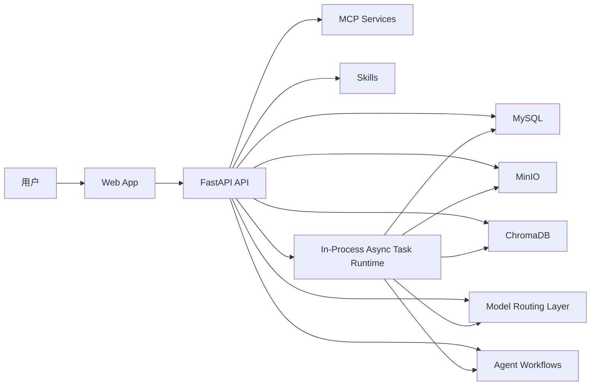
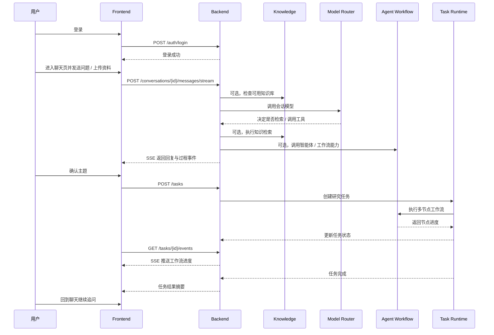

# PaperChatAgent 架构文档

## 1. 文档目标

本文档用于冻结 PaperChatAgent V1 的系统边界、模块职责和主业务链路，确保后续实现与文档叙事保持一致。

本轮文档重构后的核心原则只有一条：

`聊天是主链路，其余能力以独立模块存在，并在聊天阶段按需被调用。`

## 2. 系统目标摘要

PaperChatAgent V1 的目标是构建一个聊天优先的研究助手，而不是一个以知识库或工作区为中心的平台。

系统目标如下：

- 以聊天页作为默认入口
- 以会话作为用户长期使用的主对象
- 以知识库作为独立资料模块，负责资料解析与检索来源管理
- 以智能体作为独立能力模块，负责内置和未来可扩展的工作流能力
- 以 MCP 服务和 Skills 作为独立配置模块，提供可接入的工具能力
- 以模型模块作为配置与路由层，统一管理不同逻辑模型槽位
- 以后台任务页展示智能体 / 工作流执行进度
- 以数据看板展示系统观测指标

## 3. 系统上下文



上下文说明：

- `Frontend` 负责聊天、模块导航、最近会话、任务进度和配置界面。
- `Backend` 提供 REST / SSE 接口，负责会话、知识资料、模型调用协调和任务触发。
- `Model Routing Layer` 负责不同模型槽位的统一调用。
- `ChromaDB` 提供向量检索能力，服务知识库检索场景。
- `Agent Workflows` 承载内置多节点研究工作流及未来扩展工作流。
- `MCP Services` 与 `Skills` 提供工具调用能力。
- `In-Process Async Task Runtime` 负责当前版本的长任务执行与恢复控制。

## 4. 主业务时序



## 5. 模块职责

### 5.1 Auth

职责：

- 注册、登录、登出、会话恢复
- Cookie / Bearer 双兼容认证

不负责：

- 复杂 RBAC
- 团队协作权限

### 5.2 Chat

职责：

- 管理最近会话与消息历史
- 承载用户主链路
- 协调模型调用、知识检索、工具调用和结果回流

不负责：

- 知识库运营
- 自由编排工作流
- 系统级观测指标汇总

### 5.3 Knowledge

职责：

- 管理知识库、文件、解析状态、索引状态
- 保存原始资料、解析结果和向量检索来源

不负责：

- 直接替代聊天成为入口
- 决定聊天中是否一定要检索

### 5.4 Agents

职责：

- 管理内置智能体与工作流定义
- 暴露默认多节点研究工作流
- 为聊天和后台任务提供能力对象

不负责：

- 成为用户唯一入口
- 承担通用任务监控

### 5.5 MCP Services

职责：

- 管理 MCP 服务配置
- 暴露可被模型调用的外部工具能力

### 5.6 Skills

职责：

- 管理 Skill 配置
- 暴露可复用技能能力

### 5.7 Models

职责：

- 管理逻辑模型槽位与供应商配置
- 提供统一模型路由层

### 5.8 Background Tasks

职责：

- 展示研究任务与工作流运行进度
- 展示当前节点、节点状态、结果摘要

说明：

- 后台任务页延续当前产品认知，主要是“看智能体进度”
- 它不是一个泛化的任务平台或运维平台

### 5.9 Dashboard

职责：

- 展示模型调用、输入输出量、任务分布等指标
- 提供轻量可视化观测能力

## 6. 前后端分层

### 6.1 Monorepo 结构

当前仓库采用前后端同仓结构：

```text
PaperChatAgent/
├── apps/
│   ├── frontend/
│   └── backend/
├── docs/
├── designs/
├── images/
├── sql/
├── README.md
├── 需求文档.md
└── requirements.md
```

### 6.2 目标模块划分

前端目标模块：

- `chat`
- `knowledge`
- `agents`
- `mcp`
- `skills`
- `models`
- `tasks`
- `dashboard`

后端目标服务：

- `auth`
- `chat`
- `knowledge`
- `agents`
- `mcp`
- `skills`
- `model_router`
- `task`
- `dashboard`
- `storage`

### 6.3 运行时基础设施

- `MySQL`：结构化数据
- `MinIO`：文件与工件存储
- `ChromaDB`：向量检索
- `Python asyncio`：进程内异步任务与任务恢复控制

## 7. 存储与运行边界

### 7.1 MySQL

保存以下核心对象：

- 用户与登录会话
- 会话与消息
- 知识库与知识文件元数据
- 研究任务与工作流运行状态
- MCP / Skills / 模型配置

### 7.2 MinIO

保存：

- 原始上传文件
- 解析中间产物
- 任务报告或导出工件

### 7.3 ChromaDB

保存：

- 知识切片向量
- 检索索引与回溯定位信息

### 7.4 In-Process Async Task Runtime

负责：

- 在 API 进程内启动异步研究任务
- 按节点保存 checkpoint
- 节点失败时自动重试
- 重试与备用模型都失败后将任务置为 `paused`
- 支持从失败节点续跑

## 8. 当前实现与目标口径的关系

本轮文档描述的是目标产品口径，而不是要求当前代码已经完全完成同构演进。

当前代码的过渡特征包括：

- 前端仍保留 `WorkbenchLayout` 等旧命名
- 后端仍保留 `paperchat_workspaces` 等历史表结构
- `GET /conversations/inbox` 等接口仍然存在，用于兼容当前前端
- 任务执行当前已经收敛为进程内异步运行器

这些内容都属于实现过渡状态，不再代表用户视角中的主对象或主链路。

## 9. 架构冻结结论

PaperChatAgent V1 的架构结论如下：

- 主入口永远是聊天
- 主对象永远是会话
- 知识库、智能体、MCP、Skills、模型、后台任务、看板都是独立模块
- 模型在聊天阶段按需检索、按需调用工具
- 后台任务继续承担“展示智能体进度”的职责
