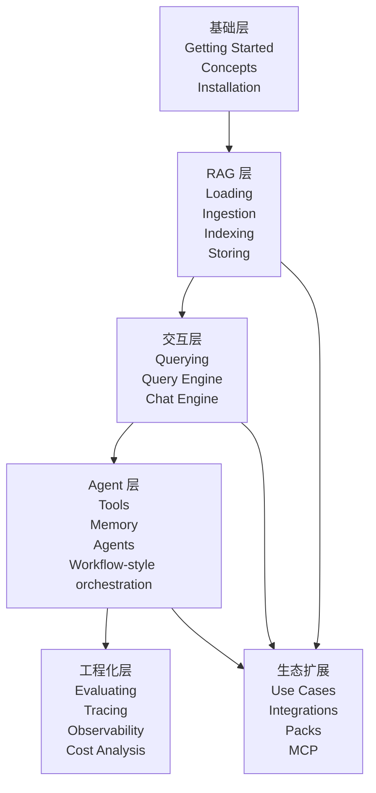
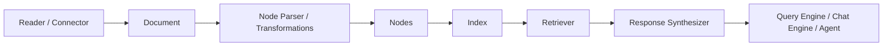
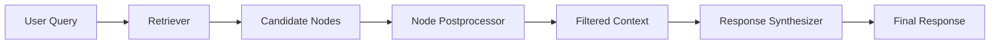
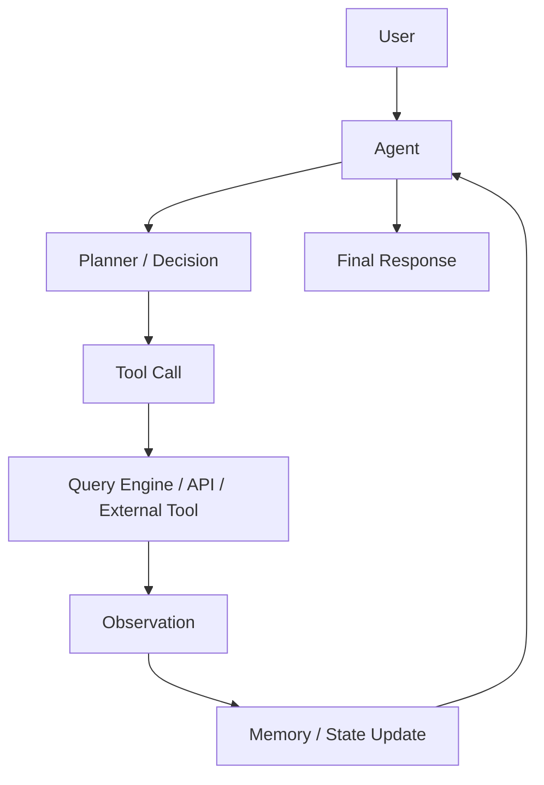

# LlamaIndex 全模块渐进式学习指南

本文档基于 LlamaIndex Python 官方文档整理，目标不是逐页翻译官网，而是把官网内容重组为一套可循序渐进学习的中文路线。你可以把它理解为一门“从 0 到能独立搭建 LlamaIndex 应用”的课程笔记。

适合读者：

- 已经会基本 Python
- 了解 LLM、Embedding、向量检索这些词，但还没系统搭过 LlamaIndex 应用
- 想从官网文档出发，建立完整的模块地图，而不是只学几个散碎示例

阅读建议：

- 第一次学习时，按章节顺序读
- 第二次回看时，把它当成模块索引，用章节末尾的官方链接继续下钻
- 动手时优先完成每章的“建议练习”，不要只停留在阅读层面

说明：

- 主线基于 LlamaIndex Python Framework 官方文档
- 示例统一使用 Python
- 同时给出 OpenAI 主线和本地模型替代路线
- 对集成生态做分类讲解，不逐条覆盖每个第三方供应商页面

---

## 目录

- [第 0 章：先建立地图](#第-0-章先建立地图)
- [第 1 章：LlamaIndex 到底解决什么问题](#第-1-章llamaindex-到底解决什么问题)
- [第 2 章：安装、包结构与最小可运行环境](#第-2-章安装包结构与最小可运行环境)
- [第 3 章：核心对象入门](#第-3-章核心对象入门)
- [第 4 章：Loading 模块怎么学](#第-4-章loading-模块怎么学)
- [第 5 章：Ingestion Pipeline 与 Node Parsers](#第-5-章ingestion-pipeline-与-node-parsers)
- [第 6 章：Models 模块](#第-6-章models-模块)
- [第 7 章：Indexing 模块](#第-7-章indexing-模块)
- [第 8 章：Storing 模块](#第-8-章storing-模块)
- [第 9 章：Querying 模块](#第-9-章querying-模块)
- [第 10 章：Deploying 模块](#第-10-章deploying-模块)
- [第 11 章：Learn 区的能力深化](#第-11-章learn-区的能力深化)
- [第 12 章：MCP、Use Cases 与官方生态怎么读](#第-12-章mcpuse-cases-与官方生态怎么读)
- [第 13 章：评估、调试与可观测性](#第-13-章评估调试与可观测性)
- [第 14 章：完整学习路线与练习任务](#第-14-章完整学习路线与练习任务)
- [术语表](#术语表)
- [官方索引清单](#官方索引清单)

---

## 第 0 章：先建立地图

### 这个模块解决什么问题

多数人第一次打开 LlamaIndex 官网，会立刻被大量导航项淹没：Getting Started、Learn、Component Guides、Use Cases、Integrations、Observability、Evaluating、MCP。真正的第一步不是马上写代码，而是先搞清楚这些区域各自负责什么。

从官网的整体结构看，可以把 LlamaIndex 生态先分成四层：

- `Framework`：核心开源开发框架，负责文档加载、切分、索引、检索、查询、聊天、agent、评估等能力
- `Agent / Workflow 能力`：面向更复杂 agentic application 的抽象，帮助你把工具调用、状态维护、事件流组织起来
- `LlamaParse`：偏文档解析能力，尤其适合 PDF、复杂版式、表格等非纯文本内容
- `LlamaCloud`：偏托管服务与云能力，不是理解开源 Framework 的必修前置

最重要的判断是：如果你现在的目标是学会 LlamaIndex 框架本身，主线应该始终停留在 `Python Framework` 文档区。

### 你需要先掌握什么

- 知道 LLM 会根据上下文生成文本
- 知道 RAG 是“检索 + 生成”
- 知道 API Key、本地模型、Python 虚拟环境这些基本工程概念

### 核心概念

- `Getting Started`：先让你跑起来，建立最小成功体验
- `Learn`：解释设计思路与构建模式，属于“为什么这样设计”
- `Use Cases`：按场景查方案，属于“遇到业务问题该看哪里”
- `Component Guides`：最重要的模块级文档，属于“每个组件到底怎么用”
- `Evaluating / Observability`：应用质量、成本、调试与链路可视化
- `MCP`：让模型或 agent 使用外部工具的一条标准化接入路径



### 最小代码示例

这一章不写代码，先建立导航心智模型。

### 进阶能力

- 学会区分“官网里的学习路径”和“框架里的运行时模块”
- 学会把问题映射到正确区域，而不是在所有页面里乱翻

### 常见坑

- 一上来就研究 agents，结果连 Document、Node、Retriever 都没搞明白
- 把 LlamaParse 或 LlamaCloud 当成理解 Framework 的前提
- 看到 Integrations 太多，误以为必须先选完整技术栈才能开始

### 和前后模块的关系

这一章是地图。下一章开始解决“为什么要有 LlamaIndex”这个根问题。

### 本章你应该会什么

- 知道官网主要导航区块分别干什么
- 知道学习主线应该围绕 Python Framework 展开
- 知道不要过早陷入工具和集成细节

### 建议练习

- 打开官方首页，按导航把每个大区块点一遍
- 用自己的话复述：`Getting Started`、`Learn`、`Component Guides` 的区别

### 下一章为什么要学

如果不知道 LlamaIndex 的问题边界，后面的模块都只是 API 名字的堆叠。

### 建议继续阅读的官网页面

- [Welcome to LlamaIndex](https://developers.llamaindex.ai/python/framework/)
- [How to read these docs](https://developers.llamaindex.ai/python/framework/getting_started/reading/)

---

## 第 1 章：LlamaIndex 到底解决什么问题

### 这个模块解决什么问题

LlamaIndex 的价值不是“帮你调一个模型 API”，而是给 LLM application 提供一套围绕数据、索引、检索、回答、工具调用和状态管理的抽象层。它最擅长的问题，是“如何让模型更稳定地使用外部知识和工具”。

### 你需要先掌握什么

- LLM 会幻觉，单靠参数知识不够
- 应用里的知识通常来自外部文档、数据库、API、文件系统、聊天记录

### 核心概念

先区分四个概念：

- `LLM application`：只要应用里有 LLM 参与，就算
- `RAG`：通过检索外部知识增强回答
- `Agentic application`：允许模型决定调用什么工具、按什么步骤处理任务
- `Workflow`：用显式步骤、状态和事件把复杂流程组织起来

LlamaIndex 的最小心智模型可以压缩成一行：

`数据 -> 文档/节点 -> 索引/存储 -> 检索 -> 合成 -> 响应`

如果把它和 LangChain 做感知层对比，可以这样理解：

- LlamaIndex 更强调“数据进入模型之前的结构化组织、检索和知识访问”
- LangChain 更常被感知为“链式编排、Agent、工具组合”
- 但这不是非黑即白，两边都在扩展，只是学习时的切入侧重点不同

### 最小代码示例

这一章不要求写完整代码，但你应该能读懂下面这条主线：

```python
documents = load_documents(...)
index = build_index(documents)
query_engine = index.as_query_engine()
answer = query_engine.query("Ask something")
```

### 进阶能力

- 看到任意示例时，能分辨它是在解决“数据接入”“检索”“回答合成”还是“agent 调度”
- 能判断一个问题到底该用 query engine、chat engine 还是 agent

### 常见坑

- 把 LlamaIndex 当成单纯向量库 SDK
- 认为 RAG 就等于“切片 + cosine similarity”
- 用 agent 解决所有问题，忽视简单 query engine 已经足够

### 和前后模块的关系

这一章给你问题边界。下一章开始真正把环境搭起来，让你跑通第一个最小示例。

### 本章你应该会什么

- 能区分 LLM application、RAG、Agentic application、Workflow
- 能复述 LlamaIndex 的最小数据流

### 建议练习

- 用自己的话写下：为什么“外部知识接入”会成为 LLM 应用的核心问题
- 观察任意一个官网示例，标注其中哪一步是 load、哪一步是 index、哪一步是 query

### 下一章为什么要学

你需要先跑通一个最小成功示例，才能让后面所有抽象有落点。

### 建议继续阅读的官网页面

- [High-Level Concepts](https://developers.llamaindex.ai/python/framework/getting_started/concepts/)
- [Introduction to RAG](https://developers.llamaindex.ai/python/framework/understanding/rag/)

---

## 第 2 章：安装、包结构与最小可运行环境

### 这个模块解决什么问题

这一章帮你搞清楚：LlamaIndex 该怎么装、为什么官网总是出现很多带命名空间的包、怎样先跑通官方 starter，再决定要不要走本地模型路线。

### 你需要先掌握什么

- Python 3.10+ 或官方文档当前要求的兼容版本
- 虚拟环境基础
- 如果走云模型路线，需要准备 API Key

### 核心概念

根据官方安装文档，学习时先记住三件事：

- `llama-index` 是一个 starter bundle，适合新手快速开始
- 随着能力扩展，你会安装 namespaced packages，比如 `llama-index-llms-openai`、`llama-index-embeddings-huggingface`、`llama-index-llms-ollama`
- 你最终会同时使用 `llama_index.core` 和若干 provider-specific 包

推荐目录结构：

```text
llamaindex-playground/
├── data/
├── notebooks/
├── storage/
├── scripts/
└── .env
```

选型表：

| 方案 | 适合场景 | 优点 | 代价 |
| --- | --- | --- | --- |
| OpenAI 主线 | 初学、想最快跑通官网示例 | 文档主线清晰、效果稳定 | 需要 API Key |
| 本地 Ollama + HuggingFace | 学习、离线实验、成本敏感 | 依赖少、成本低 | 模型质量与速度更依赖本地环境 |

### 最小代码示例

OpenAI 主线最小示例：

```bash
pip install llama-index
pip install llama-index-llms-openai
```

```python
import asyncio

from llama_index.core.agent.workflow import FunctionAgent
from llama_index.llms.openai import OpenAI


async def main() -> None:
    agent = FunctionAgent(
        tools=[],
        llm=OpenAI(model="gpt-4.1-mini"),
        system_prompt="You are a helpful assistant.",
    )
    response = await agent.run("Write a haiku about recursion in programming.")
    print(str(response))


asyncio.run(main())
```

本地模型主线最小示例：

```bash
pip install llama-index
pip install llama-index-llms-ollama llama-index-embeddings-huggingface
```

```python
from llama_index.core import Settings
from llama_index.embeddings.huggingface import HuggingFaceEmbedding
from llama_index.llms.ollama import Ollama

Settings.llm = Ollama(model="llama3.1", request_timeout=120.0)
Settings.embed_model = HuggingFaceEmbedding(model_name="BAAI/bge-small-en-v1.5")
```

### 进阶能力

- 学会区分 core 包和 provider 包
- 学会把全局默认配置放进 `Settings`
- 学会先用 starter bundle 入门，再按需细分安装

### 常见坑

- 只装了 `llama-index`，却忘了安装 OpenAI、Ollama 或 Embedding provider 包
- 明明切到了本地模型路线，却没有配置 embedding model
- 把包安装问题误以为是 LlamaIndex 本身的框架问题

### 和前后模块的关系

这一章让你能“跑起来”。下一章开始学习跑起来以后，框架里的核心对象到底是什么。

### 本章你应该会什么

- 知道 starter bundle 和 namespaced packages 的关系
- 能分别搭出 OpenAI 路线和本地路线的最小环境

### 建议练习

- 新建一个独立虚拟环境
- 先跑通 OpenAI 的最小 agent 示例
- 再切到本地模型路线，把 `Settings.llm` 和 `Settings.embed_model` 配好

### 下一章为什么要学

环境跑通不等于理解框架。真正的学习从对象模型开始。

### 建议继续阅读的官网页面

- [Installation and Setup](https://developers.llamaindex.ai/python/framework/getting_started/installation/)
- [Starter Tutorial (Using OpenAI)](https://developers.llamaindex.ai/python/framework/getting_started/starter_example/)
- [Starter Tutorial (Using Local LLMs)](https://developers.llamaindex.ai/python/framework/getting_started/starter_example_local/)

---

## 第 3 章：核心对象入门

### 这个模块解决什么问题

如果你不理解 `Document`、`Node`、metadata、transformations、`Settings`，后面所有模块都很难真正学进去。LlamaIndex 的很多能力表面上是在操作索引，底层其实都围绕 `Node` 在流动。

### 你需要先掌握什么

- 第 2 章的环境已能运行
- 知道文本切片为什么重要

### 核心概念

- `Document`：原始输入的容器，通常表示一个文件、一条记录或一份上游数据
- `Node`：框架里更细粒度的单元，通常由 document 切分、转换而来
- `metadata`：附着在 document 或 node 上的结构化信息，比如文件名、页码、来源链接、时间戳
- `chunking`：把长文本切成适合 embedding、检索和拼接上下文的小块
- `transformations`：在 ingestion 过程中对文档做切分、清洗、提取、嵌入等处理
- `Settings`：全局默认依赖配置中心，可统一配置 llm、embedding 等

对象关系图：



### 最小代码示例

```python
from llama_index.core import Document

doc = Document(
    text="LlamaIndex helps build LLM applications over your data.",
    metadata={"source": "intro-note", "topic": "framework"},
)

print(doc.metadata["source"])
```

### 进阶能力

- 学会把 metadata 当成检索质量和可追溯性的关键组成部分
- 学会理解“reader 负责接入数据，parser/ingestion 负责把它变成更适合索引的节点”
- 学会用 `Settings` 建立全局默认值，减少每个组件重复传参

### 常见坑

- 把 metadata 当成可有可无的附属信息
- 切片时只看长度，不考虑语义边界
- 把 `Document` 和 `Node` 混为一谈，导致后面理解 retriever 和 postprocessor 时混乱

### 和前后模块的关系

这一章是 Loading、Ingestion、Indexing 的共同基础。下一章开始看数据到底如何进入系统。

### 本章你应该会什么

- 能解释 Document 和 Node 的区别
- 知道 metadata、chunking、transformations 在整条链路中的位置
- 知道 `Settings` 是全局默认配置入口

### 建议练习

- 手动创建 2 个 `Document`，给它们附上不同 metadata
- 用自己的话写出“为什么检索通常发生在 node 粒度而不是 document 粒度”

### 下一章为什么要学

对象理解清楚后，才知道 Loading 模块在系统里处于哪一层。

### 建议继续阅读的官网页面

- [High-Level Concepts](https://developers.llamaindex.ai/python/framework/getting_started/concepts/)
- [Documents / Nodes](https://developers.llamaindex.ai/python/framework/module_guides/loading/documents_and_nodes/)
- [Configuring Settings](https://developers.llamaindex.ai/python/framework/module_guides/supporting_modules/settings/)

---

## 第 4 章：Loading 模块怎么学

### 这个模块解决什么问题

Loading 解决的是“数据怎么进入 LlamaIndex”。这一步看似简单，实际决定了后续 RAG 的上限。因为如果原始数据接得不对，或者元数据丢失，后面切片、索引、检索再精细也很难补回来。

### 你需要先掌握什么

- Document 和 metadata 的概念
- 文件、数据库、API、SaaS 文档源这些常见数据入口

### 核心概念

Loading 学习时建议按三层理解：

- `SimpleDirectoryReader`：本地文件入门读法，最适合第一阶段
- `Connectors / LlamaHub`：连接外部数据源，如云盘、网页、数据库、SaaS
- `LlamaParse`：当数据源是 PDF、表格、复杂版式文档时，用更强解析能力把非结构化内容提炼出来

这里最重要的一句判断是：

“读取数据”和“理解数据结构”是两件不同的事。

Loading 关注的是：

- 原始内容能否读进来
- 来源信息是否保留
- 文档边界是否清晰
- 是否为后续切分和索引保留足够上下文

选型表：

| 方式 | 适合什么场景 | 优点 | 注意点 |
| --- | --- | --- | --- |
| `SimpleDirectoryReader` | 本地 txt/pdf/md 等快速入门 | 简单、直接 | 更适合原型和学习 |
| Connectors / LlamaHub | 生产系统接 SaaS、数据库、对象存储 | 数据源丰富 | 先看 connector 的元数据支持 |
| LlamaParse | 复杂 PDF、表格、版式文档 | 解析质量更强 | 更适合难文档，不必一开始就上 |

### 最小代码示例

```python
from llama_index.core import SimpleDirectoryReader

documents = SimpleDirectoryReader("./data").load_data()
print(f"loaded {len(documents)} documents")
print(documents[0].metadata)
```

### 进阶能力

- 学会检查每个 reader 最终给你的 metadata 是什么
- 学会先验证“加载出来的数据像不像你预期的内容”
- 学会按数据源分层设计：本地入门用 `SimpleDirectoryReader`，真实系统再换 connector

### 常见坑

- 加载完文档后直接建索引，却没检查 metadata 是否为空
- 复杂 PDF 直接当纯文本读，结果表格结构丢失
- 误把 connector 当作通用答案，没有评估其输出质量

### 和前后模块的关系

Loading 只是“把数据读进来”。下一章的 Ingestion 才是“把数据处理成适合索引和检索的形态”。

### 本章你应该会什么

- 知道 `SimpleDirectoryReader`、connectors、LlamaParse 各适合什么场景
- 知道 loading 阶段最该关注原文、metadata、来源和可追溯性

### 建议练习

- 准备一份 `.md`、一份 `.txt`、一份 PDF，分别用 reader 读取
- 打印每个 document 的 metadata，比较它们的差异

### 下一章为什么要学

文档进来了，不等于已经适合检索。你还需要 ingestion 和 parser 把它整理好。

### 建议继续阅读的官网页面

- [Loading](https://developers.llamaindex.ai/python/framework/module_guides/loading/)
- [Documents / Nodes](https://developers.llamaindex.ai/python/framework/module_guides/loading/documents_and_nodes/)
- [LlamaParse](https://developers.llamaindex.ai/python/framework/module_guides/loading/llama_parse/)

---

## 第 5 章：Ingestion Pipeline 与 Node Parsers

### 这个模块解决什么问题

Ingestion 负责把“读进来的文档”转换成“适合后续索引和检索的节点”。如果说 Loading 决定了数据从哪里来，那么 Ingestion 决定了数据进来以后被如何整理。

### 你需要先掌握什么

- Document、Node、metadata、chunking
- 为什么长文不能直接拿去做 embedding 和检索

### 核心概念

- `IngestionPipeline`：把多个 transformation 串起来的一条处理链
- `Node Parser`：把 document 切成 node 的关键组件
- `Transformations`：切分、清洗、提取标题、抽取 metadata、生成 embedding 等可组合步骤
- `Metadata extraction`：为后续检索和回答增加结构化信息

理解边界：

- Loading 解决“读进来”
- Ingestion 解决“整理好”

一个典型 ingestion 流程是：

1. 读取原始文档
2. 切分成合适大小的节点
3. 保留或补充 metadata
4. 生成 embedding
5. 交给索引层

### 最小代码示例

```python
from llama_index.core import VectorStoreIndex, SimpleDirectoryReader
from llama_index.core.extractors import TitleExtractor
from llama_index.core.ingestion import IngestionPipeline
from llama_index.core.node_parser import SentenceSplitter
from llama_index.embeddings.openai import OpenAIEmbedding

documents = SimpleDirectoryReader("./data").load_data()

pipeline = IngestionPipeline(
    transformations=[
        SentenceSplitter(chunk_size=512, chunk_overlap=50),
        TitleExtractor(),
        OpenAIEmbedding(model="text-embedding-3-small"),
    ]
)

nodes = pipeline.run(documents=documents)
index = VectorStoreIndex(nodes)
```

本地路线可以把 `OpenAIEmbedding` 替换为：

```python
from llama_index.embeddings.huggingface import HuggingFaceEmbedding

embed_model = HuggingFaceEmbedding(model_name="BAAI/bge-small-en-v1.5")
```

### 进阶能力

- 学会根据内容类型调整 `chunk_size` 和 `chunk_overlap`
- 学会把标题、章节名、页码、来源链接这类信息保留进 metadata
- 学会区分“为了召回效果而切分”和“为了回答可读性而切分”的不同诉求

### 常见坑

- 切片过大，导致 embedding 和召回粒度太粗
- 切片过碎，导致语义上下文丢失
- ingestion 时没有保留来源信息，后面回答无法追溯
- 没有区分文本清洗和语义切分，导致无意义碎片进入索引

### 和前后模块的关系

这一章把数据整理成 node。下一章先补模型层，再进入索引构建。

### 本章你应该会什么

- 知道 ingestion pipeline 负责什么
- 知道 node parser 和 transformations 的角色
- 能搭出一条最小可用的 ingestion 链路

### 建议练习

- 把同一份文档分别用 `chunk_size=256` 和 `chunk_size=1024` 处理
- 对比召回结果和回答质量，写下自己的观察

### 下一章为什么要学

你会发现 ingestion 和索引几乎都离不开模型层，尤其是 embedding model 和 LLM 配置。

### 建议继续阅读的官网页面

- [Ingestion Pipeline](https://developers.llamaindex.ai/python/framework/module_guides/loading/ingestion_pipeline/)
- [Node Parsers](https://developers.llamaindex.ai/python/framework/module_guides/loading/node_parsers/)
- [Metadata Extraction](https://developers.llamaindex.ai/python/framework/module_guides/indexing/metadata_extraction/)

---

## 第 6 章：Models 模块

### 这个模块解决什么问题

Models 模块解决的是：LlamaIndex 到底用什么模型来做生成、embedding、多模态输入和 prompt 驱动。它把底层模型供应商抽象出来，让你的上层组件可以保持相对统一。

### 你需要先掌握什么

- LLM 和 embedding model 不是一回事
- Querying、Agents、Ingestion 都可能依赖模型能力

### 核心概念

Models 这一块建议分五个子问题学：

- `LLMs`：生成最终文本、推理、工具调用决策
- `Embeddings`：把文本映射到向量空间，主要用于检索
- `Local Models`：本地大模型和本地 embedding 路线
- `Multi-modal`：处理文本之外的图片等多模态输入
- `Prompts`：决定如何组织模型输入、约束输出形式

模型配置可以有两层：

- 全局默认：放进 `Settings`
- 局部覆盖：在具体组件初始化时单独传入

最常见的全局配置方式：

```python
from llama_index.core import Settings
from llama_index.embeddings.openai import OpenAIEmbedding
from llama_index.llms.openai import OpenAI

Settings.llm = OpenAI(model="gpt-4.1-mini")
Settings.embed_model = OpenAIEmbedding(model="text-embedding-3-small")
```

### 最小代码示例

本地路线示例：

```python
from llama_index.core import Settings
from llama_index.embeddings.huggingface import HuggingFaceEmbedding
from llama_index.llms.ollama import Ollama

Settings.llm = Ollama(model="llama3.1", request_timeout=120.0)
Settings.embed_model = HuggingFaceEmbedding(model_name="BAAI/bge-small-en-v1.5")
```

### 进阶能力

- 学会在全局默认和局部覆盖之间做权衡
- 学会为不同任务选择不同模型：生成、检索、重排、多模态
- 学会把 prompt 设计理解为“模块行为控制的一部分”，而不是聊天技巧

### 常见坑

- 只配置了 llm，没有配置 embedding model
- 在一个项目里混用多个 embedding 维度或模型，结果索引不兼容
- 对本地模型期望过高，没有区分“能跑”和“质量稳定”

### 和前后模块的关系

模型层是所有高级模块的共用依赖。下一章进入索引构建时，你会立刻用到 embedding 和 metadata。

### 本章你应该会什么

- 知道 LLM、Embeddings、Prompts 在 LlamaIndex 中的不同职责
- 会用 `Settings` 配置 OpenAI 路线和本地路线

### 建议练习

- 分别配置一套 OpenAI 和本地模型默认设置
- 记录同一份查询在两条路线下的回答差异

### 下一章为什么要学

模型准备好后，才轮到真正的索引构建与知识组织。

### 建议继续阅读的官网页面

- [Models](https://developers.llamaindex.ai/python/framework/module_guides/models/)
- [LLMs](https://developers.llamaindex.ai/python/framework/module_guides/models/llms/)
- [Embeddings](https://developers.llamaindex.ai/python/framework/module_guides/models/embeddings/)

---

## 第 7 章：Indexing 模块

### 这个模块解决什么问题

Indexing 解决的是“如何把节点组织成一种可高效访问的知识结构”。索引不是数据库本身，而是知识访问方式的抽象。

### 你需要先掌握什么

- nodes 和 embeddings 已准备好
- 清楚检索目标是什么：语义召回、结构召回、图关系查询

### 核心概念

- `VectorStoreIndex`：最常见主线，适合大多数 RAG 入门与生产场景
- `Document Management`：索引里的文档如何被增删改、同步、刷新
- `How each index works`：理解不同索引类型的访问逻辑
- `Property Graph Index`：当知识之间的关系结构也很重要时，图索引会更有价值
- `Metadata Extraction`：让索引不仅能做语义召回，还能用元数据过滤与约束

主线建议：

1. 先彻底掌握 `VectorStoreIndex`
2. 再理解 graph / structured variants 的价值
3. 最后再考虑混合检索与复杂路由

选型判断表：

| 场景 | 优先索引方案 | 原因 |
| --- | --- | --- |
| 通用文档问答 | `VectorStoreIndex` | 入门成本低、生态成熟 |
| 关系型知识强、图谱式推理 | `PropertyGraphIndex` | 关系是核心而不是附属信息 |
| 混合检索或复杂结构 | 组合索引 | 需要按任务拆分访问路径 |

### 最小代码示例

```python
from llama_index.core import SimpleDirectoryReader, VectorStoreIndex

documents = SimpleDirectoryReader("./data").load_data()
index = VectorStoreIndex.from_documents(documents)
```

### 进阶能力

- 学会区分“索引对象”和“底层存储后端”
- 学会基于 metadata 做过滤，而不是只靠相似度
- 学会把索引设计看成知识访问设计，而不是一次性脚本

### 常见坑

- 把向量库等同于索引本身
- 索引建好了，却没有计划后续的更新和持久化
- 所有场景都默认 `VectorStoreIndex`，不思考知识关系结构

### 和前后模块的关系

这一章解释知识如何被组织。下一章会继续问：这些索引和数据到底存在哪里，如何复用。

### 本章你应该会什么

- 知道 `VectorStoreIndex` 为什么是学习主线
- 知道图索引和混合索引适合什么问题

### 建议练习

- 用相同文档构建一个最小 `VectorStoreIndex`
- 给其中一部分节点增加 metadata，思考后面如何利用这些 metadata 过滤

### 下一章为什么要学

如果索引只能存在于内存里，你很快就会遇到重复构建、启动慢、状态丢失的问题。

### 建议继续阅读的官网页面

- [Indexing](https://developers.llamaindex.ai/python/framework/module_guides/indexing/)
- [VectorStoreIndex](https://developers.llamaindex.ai/python/framework/module_guides/indexing/vector_store_index/)
- [Property Graph Index](https://developers.llamaindex.ai/python/framework/module_guides/indexing/lpg_index_guide/)

---

## 第 8 章：Storing 模块

### 这个模块解决什么问题

Storing 解决的是：索引、节点、向量、聊天记录这些状态到底怎么持久化，怎样做到“构建一次，多次复用”。

### 你需要先掌握什么

- 索引已经建立
- 知道内存态对象和持久化状态不是同一层

### 核心概念

- `StorageContext`：把文档存储、索引存储、向量存储等组合起来的上下文容器
- `Document Stores`：保存文档或节点内容
- `Index Stores`：保存索引结构信息
- `Vector Stores`：保存 embedding 向量及相关检索能力
- `Chat Stores`：面向聊天与状态型应用
- `Persist / Load`：将构建好的索引和状态写到磁盘或远程后端，再重新加载

这里的核心工程价值很实际：

- 节省重复计算成本
- 缩短应用启动时间
- 让知识库更新和服务运行解耦

### 最小代码示例

```python
from llama_index.core import SimpleDirectoryReader, StorageContext, VectorStoreIndex
from llama_index.core import load_index_from_storage

documents = SimpleDirectoryReader("./data").load_data()
index = VectorStoreIndex.from_documents(documents)

index.storage_context.persist(persist_dir="./storage")

storage_context = StorageContext.from_defaults(persist_dir="./storage")
loaded_index = load_index_from_storage(storage_context)
```

### 进阶能力

- 学会把本地持久化当成学习入口，再向远程 vector store 迁移
- 学会区分“索引存储”和“聊天状态存储”
- 学会设计知识更新策略：全量重建、增量插入、定期同步

### 常见坑

- 每次启动都重新建索引，导致学习时还好，生产时不可用
- embedding model 改了却直接复用旧索引
- 没有规划 persist 目录和版本，导致调试混乱

### 和前后模块的关系

Storage 让知识组织有了持久性。下一章进入真正和用户交互的 Querying 层。

### 本章你应该会什么

- 知道 `StorageContext` 的作用
- 能持久化并重新加载一个索引
- 知道 document store、index store、vector store、chat store 的区别

### 建议练习

- 用相同文档构建索引并持久化
- 删除内存中的对象，再从 `./storage` 重新加载索引并查询

### 下一章为什么要学

知识存好了，下一步就是怎样把它检出来并组织成回答。

### 建议继续阅读的官网页面

- [Storing](https://developers.llamaindex.ai/python/framework/module_guides/storing/)
- [Persisting & Loading Data](https://developers.llamaindex.ai/python/framework/module_guides/storing/save_load/)
- [Vector Stores](https://developers.llamaindex.ai/python/framework/module_guides/storing/vector_stores/)

---

## 第 9 章：Querying 模块

### 这个模块解决什么问题

Querying 是“把用户问题变成知识访问和回答生成”的核心层。很多人学到这里才真正理解：RAG 不是一个黑箱，而是一组可拆分、可替换、可组合的组件。

### 你需要先掌握什么

- 索引和存储已具备
- 知道 embedding、metadata、retrieval 是怎么来的

### 核心概念

一个典型 query 流程至少有四个角色：

- `Retriever`：负责召回候选节点
- `Node Postprocessor`：负责过滤、重排、压缩、裁剪候选节点
- `Response Synthesizer`：负责根据召回内容组织最终答案
- `Router`：负责在多个检索或查询路径之间选择

再往上，还有：

- `Structured Outputs`：让结果以结构化形式返回，而不是只返回自然语言
- `Streaming`：按 token 或事件流式返回

这是整章最关键的职责划分：

- 谁负责召回：`Retriever`
- 谁负责重排和过滤：`Node Postprocessor`
- 谁负责组织答案：`Response Synthesizer`
- 谁负责选路：`Router`

RAG 数据流：



### 最小代码示例

默认 query engine：

```python
query_engine = index.as_query_engine(similarity_top_k=3)
response = query_engine.query("What are the main ideas in these documents?")
print(response)
```

显式组合 retriever 和 synthesizer：

```python
from llama_index.core import get_response_synthesizer
from llama_index.core.query_engine import RetrieverQueryEngine

retriever = index.as_retriever(similarity_top_k=5)
response_synthesizer = get_response_synthesizer(response_mode="compact")

query_engine = RetrieverQueryEngine(
    retriever=retriever,
    response_synthesizer=response_synthesizer,
)

response = query_engine.query("Summarize the key arguments.")
print(response)
```

### 进阶能力

- 学会调 `similarity_top_k`
- 学会按 metadata 或业务规则过滤召回结果
- 学会在“召回质量不足”和“回答质量不足”之间分辨问题位置

### 常见坑

- 召回内容不准，却一味去改 prompt
- 上下文太多，模型反而更乱
- query engine 可以直接解决的问题，硬要套 agent

### 和前后模块的关系

这一章是最核心的 RAG 运行层。下一章会把 query engine 扩展到 chat engine 和 agent。

### 本章你应该会什么

- 知道 retriever、postprocessor、response synthesizer、router 的职责
- 能从默认 query engine 过渡到自定义组合

### 建议练习

- 改变 `similarity_top_k`，观察回答变化
- 对同一问题分别使用默认 query engine 和手工组合的 `RetrieverQueryEngine`

### 下一章为什么要学

Querying 解决一次性问答，但真实应用还需要多轮对话、工具调用和任务协作。

### 建议继续阅读的官网页面

- [Querying](https://developers.llamaindex.ai/python/framework/module_guides/querying/)
- [Retriever](https://developers.llamaindex.ai/python/framework/module_guides/querying/retriever/)
- [Response Synthesizer](https://developers.llamaindex.ai/python/framework/module_guides/querying/response_synthesizers/)

---

## 第 10 章：Deploying 模块

### 这个模块解决什么问题

Deploying 模块并不是“部署上线”这么简单，而是把底层能力变成可直接面向用户或上层系统使用的交互对象。你会在这里看到 `Query Engine`、`Chat Engine`、`Agents`、`Memory`、`Tools` 的角色差异。

### 你需要先掌握什么

- Querying 层组件职责
- 简单的 RAG 问答已跑通

### 核心概念

四个抽象的区别：

| 抽象 | 适合什么问题 | 核心特征 |
| --- | --- | --- |
| `Query Engine` | 单轮知识问答 | 给定问题，返回一次性答案 |
| `Chat Engine` | 多轮上下文对话 | 能记住对话上下文并连续交流 |
| `Agent` | 工具调用、任务拆解、策略决策 | 模型会决定何时调用工具 |
| `Workflow` | 更复杂的显式多步流程 | 强调状态、事件和步骤编排 |

推荐学习顺序：

1. `as_query_engine()`
2. `as_chat_engine()`
3. `QueryEngineTool`
4. `FunctionAgent`
5. 再去理解 workflow-style orchestration

### 最小代码示例

Query engine：

```python
query_engine = index.as_query_engine(similarity_top_k=3)
print(query_engine.query("What does the document say about evaluation?"))
```

Chat engine：

```python
chat_engine = index.as_chat_engine(chat_mode="context", verbose=True)
response = chat_engine.chat("Please summarize the knowledge base.")
print(response)
```

把 query engine 包成 tool，再交给 agent：

```python
import asyncio

from llama_index.core.agent.workflow import FunctionAgent
from llama_index.core.tools import QueryEngineTool, ToolMetadata
from llama_index.llms.openai import OpenAI

query_tool = QueryEngineTool(
    query_engine=index.as_query_engine(similarity_top_k=3),
    metadata=ToolMetadata(
        name="knowledge_base",
        description="Query the indexed documents for factual answers.",
    ),
)


async def main() -> None:
    agent = FunctionAgent(
        tools=[query_tool],
        llm=OpenAI(model="gpt-4.1-mini"),
        system_prompt="Use tools when the answer depends on the knowledge base.",
    )
    response = await agent.run("What are the key findings in the indexed papers?")
    print(str(response))


asyncio.run(main())
```

Agent / Tool / Memory / Event 流程图：



### 进阶能力

- 学会判断：问题只需要检索，还是需要工具调用和状态管理
- 学会把 query engine 视为 tool，而不是最终只能面向用户
- 学会把 memory 看作 agent 行为稳定性的组成部分

### 常见坑

- 明明是单轮文档问答，却先上 agent
- 用 chat engine 处理需要明确工具调用的任务
- 让 agent 自由发挥太多，但没有给清晰工具说明和系统提示

### 和前后模块的关系

这一章让你看到终端交互对象的全景。下一章会进入 Learn 区，理解这些能力背后的设计模式。

### 本章你应该会什么

- 能区分 query engine、chat engine、agent、workflow
- 会把 query engine 封装成 tool，再交给 agent 使用

### 建议练习

- 先写一个 query engine 问答脚本
- 再把它改成 chat engine
- 最后再把 query engine 封成 tool，交给一个最小 `FunctionAgent`

### 下一章为什么要学

你已经看到了组件用法，但还需要理解官网 Learn 区真正想教你的“设计问题”。

### 建议继续阅读的官网页面

- [Query Engine](https://developers.llamaindex.ai/python/framework/module_guides/deploying/query_engine/)
- [Chat Engine](https://developers.llamaindex.ai/python/framework/module_guides/deploying/chat_engines/)
- [Agents](https://developers.llamaindex.ai/python/framework/module_guides/deploying/agents/)

---

## 第 11 章：Learn 区的能力深化

### 这个模块解决什么问题

Learn 区不是新 API 手册，而是“怎么设计应用”的方法论区。它回答的不是“这个类怎么导入”，而是“什么情况下应该这样构建系统”。

### 你需要先掌握什么

- Query engine、chat engine、agent 的基本差异
- 至少搭过一个最小 RAG 应用

### 核心概念

Learn 区建议按设计问题来读：

- `Building an LLM application`：如何把 LLM 集成进真实应用
- `Building a RAG pipeline`：RAG 的组件协作与设计取舍
- `Building an agent`：何时需要工具调用与任务分解
- `Maintaining state`：上下文、会话和长期状态如何保留
- `Streaming output and events`：怎样提升交互体验和可观测性
- `Human in the loop`：何时需要人工审核、确认、干预
- `Multi-agent patterns`：什么时候一个 agent 不够
- `Structured output`：何时应该返回 JSON/结构体而不是自然语言
- `Structured data extraction`：如何从非结构化输入中稳定提取结构化结果

这一章的重点不是背 API，而是学会判断：

- 什么时候需要状态
- 什么时候需要人工介入
- 什么时候要多 agent
- 什么时候输出必须结构化

### 最小代码示例

结构化输出这一类任务，思路上通常更接近：

```python
result = query_engine.query("Extract the paper title, authors, and year as structured fields.")
```

真正实现时，你应继续查看官方 structured output 相关页面，理解输出模式和 schema 约束。

### 进阶能力

- 能把“功能需求”翻译成“设计约束”
- 能判断一个需求是 RAG 问题、Agent 问题，还是 Workflow 问题
- 能避免把所有复杂性都压进一个大 prompt

### 常见坑

- 用单 agent 硬扛多角色协作问题
- 需要审核的关键动作却没有 human-in-the-loop
- 明明需要结构化输出，却用自然语言后处理硬解析

### 和前后模块的关系

Learn 区把前面学过的模块连成方法论。下一章会把它们映射到 MCP、Use Cases 和生态系统中。

### 本章你应该会什么

- 知道 Learn 区更像“设计指南”而不是“API 索引”
- 能把需求归类为状态、事件、工具、结构化输出、多 agent 等问题

### 建议练习

- 为一个“论文问答 + 总结 + 引用返回”的需求，判断它属于 query、chat、agent 还是 workflow 型问题
- 再为一个“需要用户审批后才能发邮件”的需求，判断是否需要 HITL

### 下一章为什么要学

学完方法论后，你就可以更合理地阅读 Use Cases、Integrations 和 MCP，而不是被生态内容冲散主线。

### 建议继续阅读的官网页面

- [Learn](https://developers.llamaindex.ai/python/framework/understanding/)
- [Building an agent](https://developers.llamaindex.ai/python/framework/understanding/agent/)
- [Building a RAG pipeline](https://developers.llamaindex.ai/python/framework/understanding/rag/)

---

## 第 12 章：MCP、Use Cases 与官方生态怎么读

### 这个模块解决什么问题

这一章解决的是：当你掌握主线后，怎样阅读官网里的扩展生态内容，而不迷失在大量集成和案例里。

### 你需要先掌握什么

- 已经会基本 RAG 和 agent
- 知道自己的学习目标是框架主线，而不是一口吃掉所有第三方生态

### 核心概念

#### 1. MCP

MCP 可以理解为模型或 agent 使用外部工具的一种标准化接口路径。学习重点不是先背全部 API，而是理解：

- 工具能力如何被标准暴露
- agent 怎样发现和调用外部能力
- MCP 在复杂工具集成中为什么比散乱自定义更有组织

#### 2. Use Cases

Use Cases 更像场景目录，建议按以下分类去看：

- RAG
- Chatbot
- Agent
- Text-to-SQL
- CSV / 表格问答
- Graph
- Multimodal
- Prompting / extraction

#### 3. Integrations

Integrations 不要逐页硬读。建议按下面四类管理认知：

- 模型层：OpenAI、Anthropic、Ollama、HuggingFace 等
- 存储层：各种 vector store、document store、chat store
- 数据源层：文件、数据库、SaaS、对象存储
- 工程化层：observability、tracing、evaluation

#### 4. Llama Packs / Full-stack Projects / FAQ

- `Llama Packs`：预封装模式或可复用方案，适合学完主线后借鉴结构
- `Full-stack Projects`：看完整应用如何组合这些能力
- `FAQ`：解决概念误区和常见工程问题

### 最小代码示例

这一章不强调代码，重点是阅读策略。

### 进阶能力

- 学会按场景查 Use Cases，而不是按“我还没看过这页”去机械浏览
- 学会把 integrations 当作“替换底座”，而不是新的学习主线
- 学会用 MCP 思维组织工具能力

### 常见坑

- 每看到一个 provider 就想装一遍
- 还没掌握主线就开始收集 Llama Packs
- 把 Use Case 页面当作从头系统学习的主入口

### 和前后模块的关系

生态内容是扩展，不是主线。最后一章前，你还需要先补上评估、调试和可观测性。

### 本章你应该会什么

- 知道怎样读 MCP、Use Cases、Integrations、Packs 和 FAQ
- 知道哪些内容应该在主线之后再看

### 建议练习

- 选一个你最关心的 use case，比如论文问答或聊天机器人，只深挖这一条
- 选一个最适合你的模型 provider 和一个最适合你的 vector store，先不要扩展更多

### 下一章为什么要学

会搭系统不代表系统可靠。你还需要学会评估质量、看链路和排查问题。

### 建议继续阅读的官网页面

- [MCP](https://developers.llamaindex.ai/python/framework/module_guides/mcp/)
- [Use Cases](https://developers.llamaindex.ai/python/framework/use_cases/)
- [Integrations](https://developers.llamaindex.ai/python/framework/community/integrations/)

---

## 第 13 章：评估、调试与可观测性

### 这个模块解决什么问题

LlamaIndex 应用最危险的阶段，是“好像能跑了，于是默认它就是对的”。评估、调试和可观测性解决的是：系统到底答得准不准、检得对不对、花了多少钱、慢在什么地方、出了错该怎么查。

### 你需要先掌握什么

- 已经有一个最小应用原型
- 知道 query、chat、agent 至少一种已经可运行

### 核心概念

建议把观察维度拆成五类：

- `Retrieval quality`：检索结果是否相关、是否遗漏关键信息
- `Response quality`：最终回答是否准确、完整、可追溯
- `Cost`：模型调用和向量构建成本是否可接受
- `Latency`：用户请求耗时是否稳定
- `Trace`：一次请求经历了哪些步骤、用了哪些工具、拿到了哪些节点

这一章的关键模块包括：

- `Evaluating`
- `Cost Analysis`
- `Tracing and Debugging`
- `Observability`
- `Callbacks / Instrumentation`

排错表：

| 症状 | 更可能的问题位置 | 优先排查方向 |
| --- | --- | --- |
| 空召回或召回极弱 | Loading / Ingestion / Embedding | 文档是否读进来、切片是否过碎、embedding 是否配置正确 |
| 回答泛泛而谈 | Retriever / Synthesizer | top_k 是否过低、上下文是否不足、合成模式是否合适 |
| 回答与原文不一致 | Response / Prompt / Agent 决策 | 是否脱离检索上下文自由发挥、是否缺乏引用约束 |
| 成本过高 | 模型选择 / 上下文长度 | 是否每次都喂太多节点、是否用了过强模型 |
| 响应很慢 | 检索后端 / LLM / 工具链 | trace 一次完整请求，定位慢点 |

### 最小代码示例

这一章的主角更多是 trace、回调、评测流程，而不是一个单独 API。学习时优先按官方页面走一遍 tracing 和 observability。

### 进阶能力

- 学会把问题分层定位，而不是一股脑调 prompt
- 学会建立小规模评测集，比较不同切分、模型和检索参数
- 学会用 trace 解释系统行为，而不是靠猜

### 常见坑

- 没有测试集，只凭几次主观体验判断系统质量
- 回答不对就改 prompt，却不看 retriever 召回了什么
- agent 路径很复杂，但没有 trace 和 instrumentation

### 和前后模块的关系

这章是工程化收口。最后一章会把前面所有内容整理成真实学习计划和练习路径。

### 本章你应该会什么

- 知道 retrieval quality、response quality、cost、latency、trace 是五个不同维度
- 知道官方文档中评估、调试、可观测性的阅读入口

### 建议练习

- 准备 10 个固定问题，比较不同 chunk size 和 top_k 的效果
- 针对一条失败回答，回看它的召回节点，写出问题更像出在哪一层

### 下一章为什么要学

你已经学完模块，现在需要把它们串成一个可以执行的学习与实战计划。

### 建议继续阅读的官网页面

- [Evaluating](https://developers.llamaindex.ai/python/framework/understanding/evaluating/evaluating/)
- [Tracing and Debugging](https://developers.llamaindex.ai/python/framework/understanding/tracing_and_debugging/tracing_and_debugging/)
- [Observability](https://developers.llamaindex.ai/python/framework/module_guides/observability/)

---

## 第 14 章：完整学习路线与练习任务

### 这个模块解决什么问题

这一章把前面的“模块地图”转成“可执行的学习计划”。如果你只是看懂每章大意，但没有连起来做练习，很难形成真正的工程能力。

### 你需要先掌握什么

- 至少完整读完前面各章一次

### 核心概念

推荐把学习拆成三个阶段。

#### 阶段一：1 天体验

目标：

- 跑通一个最小示例
- 建立对 `Document -> Index -> Query` 的第一印象

必做实验：

- OpenAI 路线最小 `FunctionAgent`
- `SimpleDirectoryReader + VectorStoreIndex + as_query_engine()`

完成标准：

- 你能解释 starter bundle、Document、Index、Query Engine 的关系

#### 阶段二：3 天入门

目标：

- 掌握一条完整 RAG 链路
- 理解 ingestion、storage、retriever、synthesizer 的职责边界

必做实验：

- 用 `IngestionPipeline` 重建一份知识库
- 做一次本地持久化与重载
- 手动组合 `RetrieverQueryEngine`

完成标准：

- 你能解释一个失败回答更可能出在 loading、ingestion、indexing 还是 querying

#### 阶段三：1 周系统掌握

目标：

- 从单轮问答扩展到多轮对话与工具调用
- 学会初步评估、调试和选型

必做实验：

- 用 chat engine 做一个多轮知识库助手
- 把 query engine 封装成 tool 交给 agent
- 做一个小型评测集，对比不同 chunk size、top_k、模型路线

完成标准：

- 你能独立判断一个需求该用 query、chat、agent 还是 workflow-style orchestration

### 最小代码示例

综合练习 1：最小 RAG

```python
from llama_index.core import SimpleDirectoryReader, VectorStoreIndex

documents = SimpleDirectoryReader("./data").load_data()
index = VectorStoreIndex.from_documents(documents)
query_engine = index.as_query_engine(similarity_top_k=3)
print(query_engine.query("Summarize the key ideas in the documents."))
```

综合练习 2：持久化知识库问答

```python
from llama_index.core import StorageContext, load_index_from_storage

storage_context = StorageContext.from_defaults(persist_dir="./storage")
index = load_index_from_storage(storage_context)
print(index.as_query_engine().query("What topics are covered?"))
```

综合练习 3：多轮工具型 Agent

```python
import asyncio

from llama_index.core.agent.workflow import FunctionAgent
from llama_index.core.tools import QueryEngineTool, ToolMetadata
from llama_index.llms.openai import OpenAI

tool = QueryEngineTool(
    query_engine=index.as_query_engine(similarity_top_k=3),
    metadata=ToolMetadata(
        name="knowledge_base",
        description="Useful for answering questions grounded in the indexed documents.",
    ),
)


async def main() -> None:
    agent = FunctionAgent(
        tools=[tool],
        llm=OpenAI(model="gpt-4.1-mini"),
        system_prompt="Use the tool when you need factual support from the documents.",
    )
    print(await agent.run("Compare the main ideas and mention supporting evidence."))


asyncio.run(main())
```

### 进阶能力

- 学会自己设计学习闭环：阅读、实验、记录、比较、回看官方文档
- 学会从 use case 倒推需要掌握哪些模块，而不是盲目把所有模块平均用力

### 常见坑

- 只读不练
- 只看单轮问答，不进入 chat、agent、evaluation
- 一开始就想做生产级复杂系统，结果基础没打稳

### 和前后模块的关系

这是全书收口章节。接下来建议你把本章当作执行计划，边做边回看对应章节。

### 本章你应该会什么

- 知道 1 天、3 天、1 周三个阶段分别该完成什么
- 知道三个综合练习的目标和难度递进

### 建议练习

- 严格按 1 天、3 天、1 周的顺序完成任务
- 为每个实验记录：配置、问题、结果、失败原因和改进点

### 下一章为什么要学

本书正文到这里结束。剩下两个部分是术语表和官方索引，方便你反复查阅。

### 建议继续阅读的官网页面

- [Starter Tutorial (Using OpenAI)](https://developers.llamaindex.ai/python/framework/getting_started/starter_example/)
- [Building a RAG pipeline](https://developers.llamaindex.ai/python/framework/understanding/rag/)
- [Agents](https://developers.llamaindex.ai/python/framework/module_guides/deploying/agents/)

---

## 术语表

| 术语 | 中文理解 | 备注 |
| --- | --- | --- |
| Document | 原始文档容器 | 通常是 reader 的输出 |
| Node | 更细粒度的知识单元 | 通常是切分和转换后的结果 |
| Metadata | 元数据 | 例如来源、页码、标签、时间 |
| Reader | 数据读取器 | 负责把外部数据读进来 |
| Ingestion Pipeline | 数据整理流水线 | 切分、清洗、提取、embedding |
| Index | 索引抽象 | 组织知识访问方式 |
| VectorStoreIndex | 向量索引主线 | 最常见的 RAG 入门方案 |
| Retriever | 检索器 | 负责召回候选节点 |
| Node Postprocessor | 节点后处理器 | 过滤、重排、压缩上下文 |
| Response Synthesizer | 回答合成器 | 负责组织最终输出 |
| Query Engine | 单轮问答入口 | 常用于 RAG 问答 |
| Chat Engine | 多轮对话入口 | 有上下文连续性 |
| Tool | 工具包装 | 可供 agent 调用 |
| Agent | 工具型决策执行体 | 能根据任务选择工具 |
| Memory | 状态记忆层 | 为多轮交互和 agent 服务 |
| StorageContext | 存储上下文 | 组织 store 与持久化加载 |

---

## 官方索引清单

### 入门与概念

- [Welcome to LlamaIndex](https://developers.llamaindex.ai/python/framework/)
- [How to read these docs](https://developers.llamaindex.ai/python/framework/getting_started/reading/)
- [High-Level Concepts](https://developers.llamaindex.ai/python/framework/getting_started/concepts/)
- [Installation and Setup](https://developers.llamaindex.ai/python/framework/getting_started/installation/)
- [Starter Tutorial (Using OpenAI)](https://developers.llamaindex.ai/python/framework/getting_started/starter_example/)
- [Starter Tutorial (Using Local LLMs)](https://developers.llamaindex.ai/python/framework/getting_started/starter_example_local/)

### Learn

- [Learn](https://developers.llamaindex.ai/python/framework/understanding/)
- [Introduction to RAG](https://developers.llamaindex.ai/python/framework/understanding/rag/)
- [Building an agent](https://developers.llamaindex.ai/python/framework/understanding/agent/)
- [Evaluating](https://developers.llamaindex.ai/python/framework/understanding/evaluating/evaluating/)
- [Tracing and Debugging](https://developers.llamaindex.ai/python/framework/understanding/tracing_and_debugging/tracing_and_debugging/)

### Component Guides

- [Loading](https://developers.llamaindex.ai/python/framework/module_guides/loading/)
- [Documents / Nodes](https://developers.llamaindex.ai/python/framework/module_guides/loading/documents_and_nodes/)
- [Ingestion Pipeline](https://developers.llamaindex.ai/python/framework/module_guides/loading/ingestion_pipeline/)
- [Node Parsers](https://developers.llamaindex.ai/python/framework/module_guides/loading/node_parsers/)
- [Models](https://developers.llamaindex.ai/python/framework/module_guides/models/)
- [LLMs](https://developers.llamaindex.ai/python/framework/module_guides/models/llms/)
- [Embeddings](https://developers.llamaindex.ai/python/framework/module_guides/models/embeddings/)
- [Indexing](https://developers.llamaindex.ai/python/framework/module_guides/indexing/)
- [VectorStoreIndex](https://developers.llamaindex.ai/python/framework/module_guides/indexing/vector_store_index/)
- [Metadata Extraction](https://developers.llamaindex.ai/python/framework/module_guides/indexing/metadata_extraction/)
- [Property Graph Index](https://developers.llamaindex.ai/python/framework/module_guides/indexing/lpg_index_guide/)
- [Storing](https://developers.llamaindex.ai/python/framework/module_guides/storing/)
- [Persisting & Loading Data](https://developers.llamaindex.ai/python/framework/module_guides/storing/save_load/)
- [Vector Stores](https://developers.llamaindex.ai/python/framework/module_guides/storing/vector_stores/)
- [Querying](https://developers.llamaindex.ai/python/framework/module_guides/querying/)
- [Retriever](https://developers.llamaindex.ai/python/framework/module_guides/querying/retriever/)
- [Response Synthesizer](https://developers.llamaindex.ai/python/framework/module_guides/querying/response_synthesizers/)
- [Query Engine](https://developers.llamaindex.ai/python/framework/module_guides/deploying/query_engine/)
- [Chat Engine](https://developers.llamaindex.ai/python/framework/module_guides/deploying/chat_engines/)
- [Agents](https://developers.llamaindex.ai/python/framework/module_guides/deploying/agents/)
- [Memory](https://developers.llamaindex.ai/python/framework/module_guides/deploying/agents/memory/)
- [Configuring Settings](https://developers.llamaindex.ai/python/framework/module_guides/supporting_modules/settings/)
- [MCP](https://developers.llamaindex.ai/python/framework/module_guides/mcp/)
- [Observability](https://developers.llamaindex.ai/python/framework/module_guides/observability/)

### 用例与生态

- [Use Cases](https://developers.llamaindex.ai/python/framework/use_cases/)
- [Integrations](https://developers.llamaindex.ai/python/framework/community/integrations/)
- [Llama Packs](https://developers.llamaindex.ai/python/framework/community/llama_packs/)
- [Full-stack Projects](https://developers.llamaindex.ai/python/framework/community/full_stack_projects/)
- [FAQ](https://developers.llamaindex.ai/python/framework/resources/faq/)

---

## 最后怎么使用这份文档

如果你想最快入门，建议只做下面四件事：

1. 跑通第 2 章的最小示例
2. 完成第 5 章的 ingestion 实验
3. 完成第 8 章的持久化实验
4. 完成第 10 章的 query engine -> chat engine -> agent 递进实验

如果你想系统掌握，建议按章节顺序完整走一遍，并在每章结束后完成“建议练习”。当你遇到不确定的 API 细节时，优先回到本章末尾给出的官网入口继续下钻。
